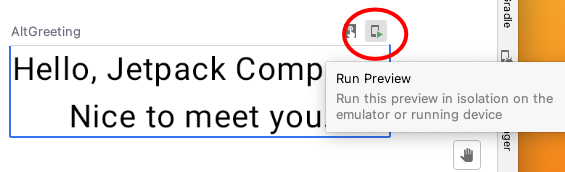

#### Summary of the Book Study "Android UI Development with Jetpack Compose"

This repository was created to share the summary materials and code examples that were developed during my study of the book "Android UI Development with Jetpack Compose" by Thomas Kunneth.

The aim is to consolidate the knowledge gained and provide a useful resource for review and future reference. Also, I hope it can be useful to other developers learning about Jetpack Compose.

The code examples and concepts covered in this repository reflect topics discussed in the book, including creating user interfaces with Jetpack Compose, managing state, navigating, and more.

Please note this is a work in progress. I will be updating the repository as I continue to progress through the book and deepen my understanding of Jetpack Compose.

#### Tools Used

This project was developed using various tools and resources, including:

- Android Studio
- Kotlin
- Jetpack Compose
- GitHub Copilot: This AI tool was used to assist in creating this documentation and translation.
- Book: "Android UI Development with Jetpack Compose" by Thomas Kunneth. Link:https://books.google.com.br/books/about/Android_UI_Development_with_Jetpack_Comp.html?id=3bJZEAAAQBAJ&redir_esc=y

### Summary
[Chapter 1: Building Your First Compose App](#chapter-1)

[Chapter 2: Understanding The Declarative Paradigm](#chapter-2)

-------------------------------------------------------------------------------------------

### <a id="chapter-1"></a>Chapter 1: Building Your First Compose App
#### WelcomeHelloApp


[Leia esta página em Português](README/README_pt-BR.md)

The `WelcomeHelloApp` is an Android application developed with the aim of demonstrating what I have learned to use from Jetpack Compose.

This application was created based on what was studied in the book "Android UI Development with Jetpack Compose" by Thomas Kunneth. The book offers a comprehensive view of Jetpack Compose and how it can be used to enhance the UI development experience on Android.

#### About the application

The `WelcomeHelloApp` is a simple application that asks the user to enter their name. Once the name is entered and the button is pressed, the application displays a personalized welcome message.

The application demonstrates the use of various components and concepts of Jetpack Compose, including:

- `@Composable` functions
- `TextField` for text input
- `Button` for user interaction
- `Box`, `Row` and `Column` for layout
- `remember` and `mutableStateOf` for state management
- `stringResource` for string resources
This application serves as an excellent starting point for anyone interested in learning and exploring more about Jetpack Compose and Android UI development.

#### Welcome Function

```kotlin
@Composable
fun Welcome(name: String) {
    Text(
        text = stringResource(id = R.string.welcome, name),
        style = MaterialTheme.typography.bodyLarge
    )
}
```

The `Welcome` function is a `@Composable` function that takes a string `name` as a parameter. Within this function, a `Text` component is created. The text of this component is obtained from the string resource `R.string.welcome`, which is formatted with the value of `name`. The style of the text is set as `MaterialTheme.typography.bodyLarge`, which is a predefined style of the Material Theme.

#### TextAndButton Function

```kotlin
@Composable
fun TextAndButton(name: MutableState<String>, nameEntered: MutableState<Boolean>) {
  Row(modifier= Modifier.padding(top = 8.dp)){
    // Creates a text field to enter the name
    TextField(
      value =  name.value,
      onValueChange = {  newValueTextField -> name.value = newValueTextField},
      placeholder = {Text(text = stringResource(id = R.string.hint))},
      modifier = Modifier
        .alignByBaseline()
        .weight(1.0F),
      singleLine = true,
      keyboardOptions = KeyboardOptions(autoCorrect = false, capitalization = KeyboardCapitalization.Words),
      keyboardActions = KeyboardActions(onAny = {nameEntered.value = true})
    )

    // Creates a button to submit the name
    Button(modifier = Modifier
      .alignByBaseline()
      .padding(8.dp),
      onClick = {nameEntered.value = true}
    ){
      Text(text = stringResource(id = R.string.done))
    }
  }
}
```

The `TextAndButton` function is a `@Composable` function that takes two parameters: `name` and `nameEntered`, both of type `MutableState`. Within this function, a `Row` component is created with a modifier that adds a padding of 8dp at the top.

Inside the `Row`, a `TextField` component is created with various properties:

- `value = name.value`: Sets the current value of the `TextField` to the current value of `name`.
- `onValueChange = { newValueTextField -> name.value = newValueTextField }`: Sets a callback that is called when the value of the `TextField` changes. Updates the value of `name` to the new value of the `TextField`.
- `placeholder = { Text(text = stringResource(id = R.string.hint)) }`: Sets a placeholder for the `TextField` that is displayed when the `TextField` is empty.

#### Showing a greeting message

```kotlin
@Composable
fun Hello() {
    // Creates two mutable variables that can be observed for changes.
    // `name` is a string that stores the name entered by the user.
    // `nameEntered` is a boolean that stores whether the user has already entered their name or not.
    val name = remember { mutableStateOf("") }
    val nameEntered = remember { mutableStateOf(false) }

    // Creates a Box, which is a layout that stacks its children along the z-axis.
    // This Box is modified to fill all available space and have a padding of 16.dp.
    // The content of the Box is centered using contentAlignment = Alignment.Center
    Box(
        modifier = Modifier
            .fillMaxSize()
            .padding(16.dp),
        contentAlignment = Alignment.Center
    ) {
        // Checks if the name has already been entered.
        if (nameEntered.value) {
            // If the name has been entered, displays a greeting with the name.
            Greeting(name.value)
        } else {
            // If the name has not yet been entered, displays the Welcome function and the TextAndButton function.
            Column(horizontalAlignment = Alignment.CenterHorizontally) {
                Welcome()
                TextAndButton(name, nameEntered)
            }
        }
    }
}
```

This is a `Composable` component called `Hello`. Within this component, two mutable state variables are created using the `remember` function. The `remember` function is used to preserve state between recompositions. `name` is a string that stores the name entered by the user and `nameEntered` is a boolean that stores whether the user has already entered their name or not.

Next, a `Box` component is created. `Box` is a layout that stacks its children along the z-axis. This `Box` is modified to fill all available space and have a padding of 16.dp. The content of the `Box` is centered.

Inside the `Box`, there is a check to see if the name has already been entered. If the name has been entered (`nameEntered.value` is `true`), then a greeting is displayed with the user's name. This is done by calling the `Greeting` function with `name.value` as an argument.

If the name has not yet been entered (`nameEntered.value` is `false`), then the `Welcome` function and the `TextAndButton` function are displayed. These are displayed within a `Column` component, which is a layout that arranges its children along the vertical axis. The horizontal alignment of the children within the `Column` is set to `Alignment.CenterHorizontally`, which means that the children will be horizontally centered.


--------------------------------------------------------------------------------------------
**NOTE:** Here are some extra explanations from the book "Android UI Development with    Jetpack Compose".
____________________________________________________________________________________________

#### Group @Preview
Grouping previews in Android Studio is a handy feature that allows you to organize your ``@Preview`` annotated composable functions into different groups.

To group your previews, you can add a group parameter to the @Preview annotation and assign a group name to it. Here's an example:
````kotlin
    @Preview(group = "my-group-1")
````
In Android Studio, you can switch between different groups in the preview pane.


and you can switch between different layouts in the preview pane.


#### Deploying a composable function
To deploy a composable function to real device or the Android Emulator, click **Run Preview** button, which is a small image in the upper-right corner of a preview.



To run your Compose app, select your target device, make sure that the app module is selected, and
press the green play button.

 

### <a id="chapter-2"></a>Chapter 2: Understanding The Declarative Paradigm

In this chapter, we will briefly review how Android UIs are
implemented with traditional classes and techniques. You will learn about some issues of this approach,
and how a declarative framework helps overcome them.