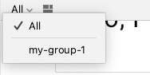

# Resumo do Estudo do Livro "Android UI Development with Jetpack Compose"

Este repositório foi criado para compartilhar os materiais de resumo e os exemplos de código que foram desenvolvidos durante o meu estudo do livro "Android UI Development with Jetpack Compose" de Thomas Kunneth.

O objetivo é consolidar o conhecimento adquirido e fornecer um recurso útil para revisão e referência futura. Além disso, espero que possa ser útil para outros desenvolvedores que estão aprendendo sobre o Jetpack Compose.

Os exemplos de código e os conceitos abordados neste repositório refletem os tópicos discutidos no livro, incluindo a criação de interfaces de usuário com o Jetpack Compose, o gerenciamento de estado, a navegação e muito mais.

Por favor, note que este é um trabalho em progresso. Estarei atualizando o repositório à medida que continuo a avançar no livro e a aprofundar meu entendimento do Jetpack Compose.

## Ferramentas Usadas

Este projeto foi desenvolvido usando várias ferramentas e recursos, incluindo:

- Android Studio
- Kotlin
- Jetpack Compose
- GitHub Copilot: Esta ferramenta de IA foi usada para auxiliar na criação desta documentação e tradução.
- Livro: "Desenvolvimento de UI Android com Jetpack Compose" por Thomas Kunneth. Link:https://books.google.com.br/books/about/Android_UI_Development_with_Jetpack_Comp.html?id=3bJZEAAAQBAJ&redir_esc=y

### Summary
[Chapter 1: Building Your First Compose App](#chapter-1)

[Chapter 2: Understanding The Declarative Paradigm](#chapter-2)

-------------------------------------------------------------------------------------------

### <a id="chapter-1"></a>Chapter 1: Building Your First Compose App

#### WelcomeHelloApp


[Read this page in English](../README.md)

O `WelcomeHelloApp` é um aplicativo Android desenvolvido com o objetivo de demonstrar o que aprendi a usar do Jetpack Compose.

Este aplicativo foi criado com base no que foi estudado no livro "Desenvolvimento de UI Android com Jetpack Compose" de Thomas Kunneth. O livro oferece uma visão abrangente do Jetpack Compose e como ele pode ser usado para melhorar a experiência de desenvolvimento de UI no Android.

## Sobre o aplicativo

O `WelcomeHelloApp` é um aplicativo simples que pede ao usuário para inserir seu nome. Uma vez que o nome é inserido e o botão é pressionado, o aplicativo exibe uma mensagem de boas-vindas personalizada.

O aplicativo demonstra o uso de vários componentes e conceitos do Jetpack Compose, incluindo:

- Funções `@Composable`
- `TextField` para entrada de texto
- `Button` para interação do usuário
- `Box`, `Row` e `Column` para layout
- `remember` e `mutableStateOf` para gerenciamento de estado
- `stringResource` para recursos de string
  Este aplicativo serve como um excelente ponto de partida para quem está interessado em aprender e explorar mais sobre o Jetpack Compose e o desenvolvimento de UI para Android.
- 
## Função Welcome

```kotlin
@Composable
fun Welcome(name: String) {
    Text(
        text = stringResource(id = R.string.welcome, name),
        style = MaterialTheme.typography.bodyLarge
    )
}
```

A função `Welcome` é uma função `@Composable` que recebe uma string `name` como parâmetro. Dentro desta função, um componente `Text` é criado. O texto deste componente é obtido do recurso de string `R.string.welcome`, que é formatado com o valor de `name`. O estilo do texto é definido como `MaterialTheme.typography.bodyLarge`, que é um estilo predefinido do Material Theme.

## Função TextAndButton

```kotlin
@Composable
fun TextAndButton(name: MutableState<String>, nameEntered: MutableState<Boolean>) {
  Row(modifier= Modifier.padding(top = 8.dp)){
    // Cria um campo de texto para inserir o nome
    TextField(
      value =  name.value,
      onValueChange = {  newValueTextField -> name.value = newValueTextField},
      placeholder = {Text(text = stringResource(id = R.string.hint))},
      modifier = Modifier
        .alignByBaseline()
        .weight(1.0F),
      singleLine = true,
      keyboardOptions = KeyboardOptions(autoCorrect = false, capitalization = KeyboardCapitalization.Words),
      keyboardActions = KeyboardActions(onAny = {nameEntered.value = true})
    )

    // Cria um botão para enviar o nome
    Button(modifier = Modifier
      .alignByBaseline()
      .padding(8.dp),
      onClick = {nameEntered.value = true}
    ){
      Text(text = stringResource(id = R.string.done))
    }
  }
}
```

A função `TextAndButton` é uma função `@Composable` que recebe dois parâmetros: `name` e `nameEntered`, ambos do tipo `MutableState`. Dentro desta função, um componente `Row` é criado com um modificador que adiciona um padding de 8dp no topo.

Dentro da `Row`, um componente `TextField` é criado com várias propriedades:

- `value = name.value`: Define o valor atual do `TextField` para o valor atual de `name`.
- `onValueChange = { newValueTextField -> name.value = newValueTextField }`: Define um callback que é chamado quando o valor do `TextField` muda. Atualiza o valor de `name` para o novo valor do `TextField`.
- `placeholder = { Text(text = stringResource(id = R.string.hint)) }`: Define um placeholder para o `TextField` que é exibido quando o `TextField` está vazio.

## Mostrando uma mensagem de saudação

```kotlin
@Composable
fun Hello() {
    // Cria duas variáveis mutáveis que podem ser observadas para mudanças.
    // `name` é uma string que armazena o nome inserido pelo usuário.
    // `nameEntered` é um booleano que armazena se o usuário já inseriu seu nome ou não.
    val name = remember { mutableStateOf("") }
    val nameEntered = remember { mutableStateOf(false) }

    // Cria uma Box, que é um layout que empilha seus filhos ao longo do eixo z.
    // Esta Box é modificada para preencher todo o espaço disponível e ter um padding de 16.dp.
    // O conteúdo da Box é centralizado usando contentAlignment = Alignment.Center
    Box(
        modifier = Modifier
            .fillMaxSize()
            .padding(16.dp),
        contentAlignment = Alignment.Center
    ) {
        // Verifica se o nome já foi inserido.
        if (nameEntered.value) {
            // Se o nome foi inserido, exibe uma saudação com o nome.
            Greeting(name.value)
        } else {
            // Se o nome ainda não foi inserido, exibe a função Welcome e a função TextAndButton.
            Column(horizontalAlignment = Alignment.CenterHorizontally) {
                Welcome()
                TextAndButton(name, nameEntered)
            }
        }
    }
}
```

Este é um componente `Composable` chamado `Hello`. Dentro deste componente, duas variáveis de estado mutáveis são criadas usando a função `remember`. A função `remember` é usada para preservar o estado entre recomposições. `name` é uma string que armazena o nome inserido pelo usuário e `nameEntered` é um booleano que armazena se o usuário já inseriu seu nome ou não.

Em seguida, um componente `Box` é criado. `Box` é um layout que empilha seus filhos ao longo do eixo z. Esta `Box` é modificada para preencher todo o espaço disponível e ter um padding de 16.dp. O conteúdo da `Box` é centralizado.

Dentro da `Box`, há uma verificação para ver se o nome já foi inserido. Se o nome foi inserido (`nameEntered.value` é `true`), então uma saudação é exibida com o nome do usuário. Isso é feito chamando a função `Greeting` com `name.value` como argumento.

Se o nome ainda não foi inserido (`nameEntered.value` é `false`), então a função `Welcome` e a função `TextAndButton` são exibidas. Estas são exibidas dentro de um componente `Column`, que é um layout que organiza seus filhos ao longo do eixo vertical. O alinhamento horizontal dos filhos dentro da `Column` é definido como `Alignment.CenterHorizontally`, o que significa que os filhos serão centralizados horizontalmente.

-------------------------------------------------- ------------------------------------------
**NOTA:** Aqui estão algumas explicações extras do livro "Android UI Development with Jetpack Compose".
______________________________________________________________________________________________

## Agrupar @Preview

Agrupar pré-visualizações no Android Studio é um recurso útil que permite organizar suas funções compostas anotadas com ``@Preview`` em diferentes grupos.

Para agrupar suas pré-visualizações, você pode adicionar um parâmetro de grupo à anotação @Preview e atribuir um nome de grupo a ele. Aqui está um exemplo:

````kotlin
    @Preview(group = "meu-grupo-1")
````

No Android Studio, você pode alternar entre diferentes grupos no painel de pré-visualização.



e você pode alternar entre diferentes layouts no painel de pré-visualização.


## Implantando uma função composable

Para implantar uma função composable em um dispositivo real ou no Android Emulator, clique no botão **Run Preview**, que é uma pequena imagem no canto superior direito de uma pré-visualização.


Para executar seu aplicativo Compose, selecione seu dispositivo de destino, certifique-se de que o módulo do aplicativo esteja selecionado e pressione o botão verde de reprodução.

 

### <a id="chapter-2"></a>Chapter 2: Understanding The Declarative Paradigm
